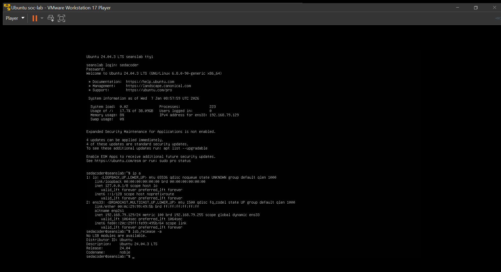
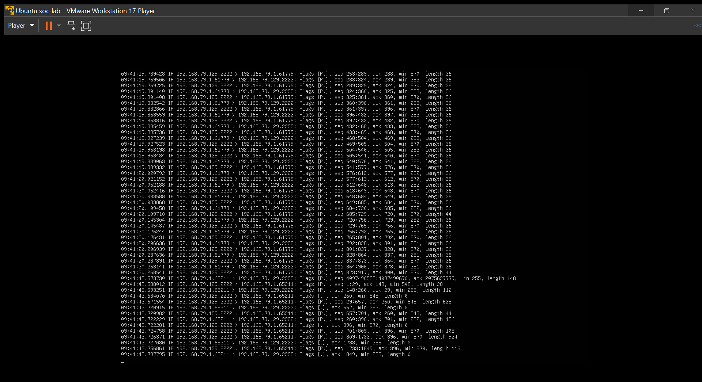

# Secure Linux Server

## Project Overview

This project demonstrates the setup and security monitoring of a hardened Linux server.
The goal was to simulate real-world Blue Team activities such as secure remote access,
network traffic monitoring, log analysis, and automated intrusion prevention.

## Objectives

- Harden SSH access on a Linux server
- Configure firewall rules to limit exposure
- Monitor live network traffic using tcpdump
- Capture traffic for forensic analysis
- Correlate network traffic with system authentication logs
- Demonstrate automated defense using Fail2Ban

## Environment Setup

- Host OS: Windows
- Virtualization: VMware Workstation
- Guest OS: Ubuntu Server
- Network Mode: NAT
- SSH Port: 2222

## SSH Hardening

SSH was configured to run on a non-default port (2222) to reduce exposure to automated scans.
Root login was disabled to enforce the principle of least privilege.

- Port 22 is a risky port since it is exposed to the internet and it is poorly monitored. So it is easily targeted by use of ssh, a remote login service.
  
## Firewall Configuration

UFW (Uncomplicated Firewall) was enabled to restrict inbound traffic.
Only SSH access on port 2222 was allowed.
- Firewalls are important for purposes of enabling network traffic control.

## Network Traffic Monitoring

Live network traffic was monitored using tcpdump on the primary network interface.
SSH traffic was filtered to observe authentication attempts in real time.
- sudo tcpdump -i ens33 port 2222

## Packet Capture and Analysis

SSH traffic was captured to a .pcap file for offline forensic analysis.
This simulates how CSIRT teams collect evidence after incidents.

- .pcap files allow investigators to note brute-force attempts and see successful logins as well.
## Log Analysis and Correlation

System authentication logs were analyzed using journalctl.
Login attempts were correlated with captured network traffic to confirm events.

## Results and Learnings

Through this project, I gained hands-on experience in Linux hardening,
network monitoring, packet analysis, and log correlation.
This mirrors real-world Blue Team and SOC analyst workflows.

## Career Relevance

This project aligns with Blue Team, SOC Analyst, and CSIRT roles.
It demonstrates foundational skills in defensive security and incident response.

