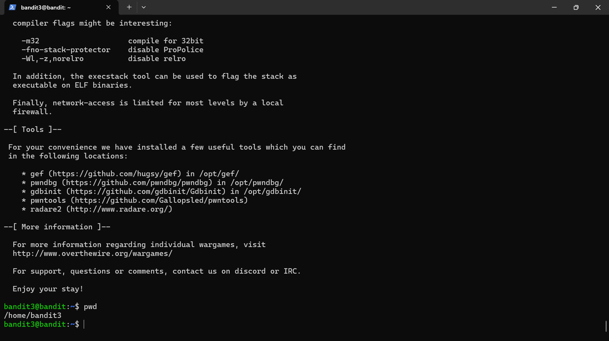

# Bandit Level 2

## Objective
To retrieve the password for the next level from a file with an unusual filename

## Skills practiced
- Linux command line
- Handling special characters in filenames
- File reading

## High-Level Approach
- Listed the files in the appropriate directory.
- Identified the correct file with an unusual name.
- Used the appropriate method to correctly reference and read the file on the command line

## Key Takeaways
- Filenames with special characters require careful handling.
- Understanding how the shell interprets input is important in security work.
- Small details in file handling can create security challenges.
## Evidence
Successful login into bandit level 3

