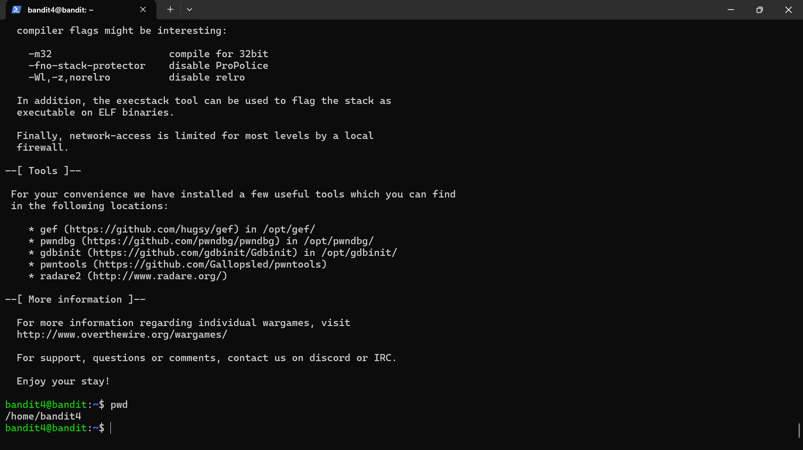

# Bandit level 3

## Objective
Retrieve the password for the next level from a hidden file in a different directory.

## Skills practiced
- Linux command line
- Accessing hidden files in a directory
- File reading

## High-Level Approach
- Listed the contents of the directory.
- Entered another directory within the home directory.
- Identified a hidden file and read the file.

## Key Takeaways
- Understanding how files are stored
- Hidden files require a special method to be uncovered.

## Evidence
Successful login to Bandit level 4:

