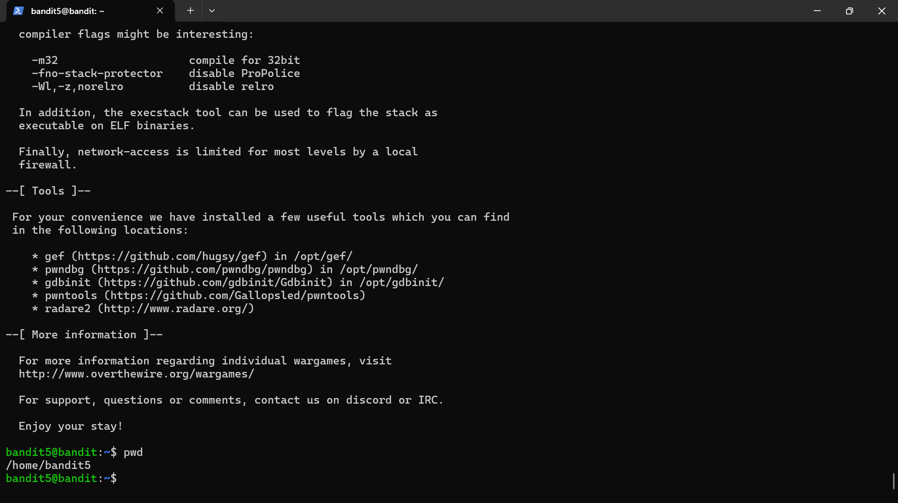

# Bandit level 4

## Objective
Retrieve the password for the next level from a file in a directory of many files.

## Skills practiced
- Linux command line
- File handling
- FIle analysis

## High-Level Approach
- Listed the contents of the directory.
- Identified the file with human readable text and read the file.

## Key Takeaways
- Understanding how to simultaneously handle many files.
- Learnt that there are many ways to tackle the same problem.

## Evidence
Successful login to level 5:

