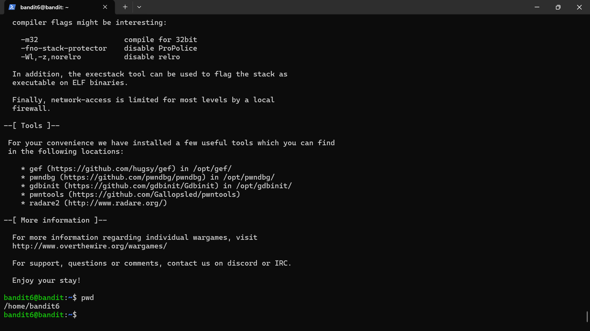

# Bandit level 5

## Objective
Retrieve the password for the next level from a specific file according to its properties.

## Skills practiced
- Linux command line
- File analysis
- File inspection

## High-Level Approach
- Listed the contents of the directory.
- Used the appropriate method to analyse the files and produce the one I needed.
- Read the file.

## Key Takeaways
- Understanding how to scan through files to find a specific one.
- Understanding the readability of files on Linux.

## Evidence
Successful login to level 6:

